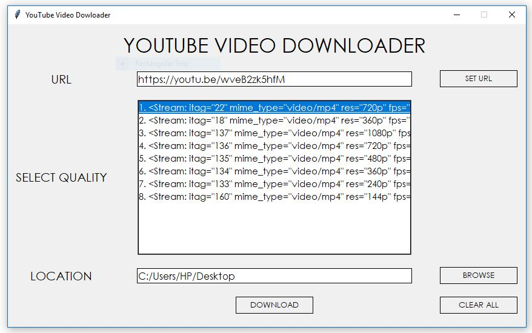
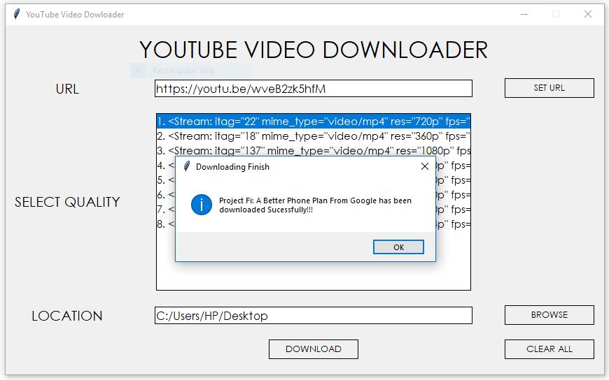

# YouTube-Video-Downloader
A simple application to download YouTube videos using Python-tkinter.

## Installation

1. This application uses the API **pytube**.
```
pip3 install pytube
```
2. For Documentation for this API check [here](https://python-pytube.readthedocs.io/en/latest/)

## Instructions to Run the Application

1. Download and Run the **ytvd.py** script.
2. Enter the URL of the YouTube video.
3. Select the Quality of the video that you want to download.
4. Select the Location where you want to store the video.
5. Click Download and the video will get downloaded.





> Depending on your internet connection the video will get downloaded and there maybe instances that the Titlebar of the application window will display **Not Responding** but it is fine just wait for sometime and the application will be good to go.
